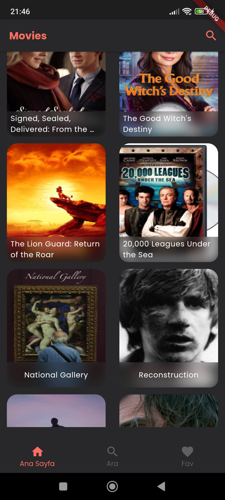
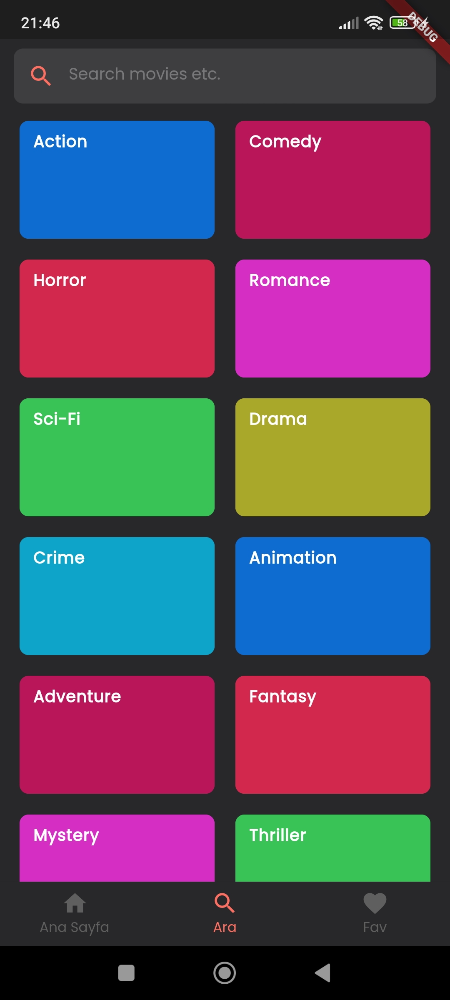
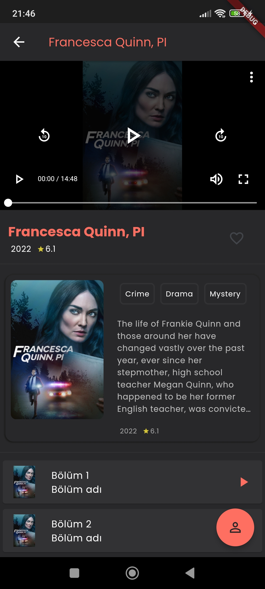

# FlutterMovie


<br>

Flutter movie app with RestAPI usage and search features

> **Note**
> current flutter version of project is outdated. You need to write below codes to terminal in order to run the project without error:

```bash
# First upgrade
$ flutter pub upgrade 

# Then clean
$ flutter clean 

# Finally get
$ flutter pub get
```

## Screenshots

<p float="left">
  
  
  
  
</p>
